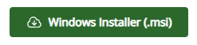

# Download movies by intercepting .m3u8 files and assemble locally
Node.js script to download m3u8 segments and assemble with ffmpeg

## Prerequisites

* Install the .m3u8 interceptor as a Chrome browser extension.
* Install Node.js to run the download script.
* Install ffmpeg to let the script assemble the downloaded segments into an .mp4 file.

### How to Install Chrome Extension

In the top right corner of the Chrome browser, find and click the puzzle-piece button

### How to Install Node.js

Go to https://nodejs.org/en/download

Find and click the button

### How to Install ffmpeg

Go to https://www.ffmpeg.org/download.html

Find and click the button 

### Use the Chrome extension to get the m3u8 file

 

### Run the script that downloads and assembles the segments

